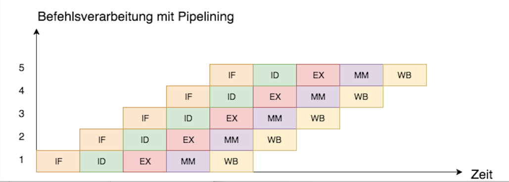

# 2. Grundlagen

Apache Beam (**B**atch + Str**eam** = **Beam**) ist ein Open Source vereinheitlichtes Modell zum Definieren und Ausführen von Batch- und Streamingdaten-Pipelines. Diese Pipelines können mithilfe von sprachspezifischen SKDs (derzeit Java und Python) erstellt und durch sogenannte Runner (z.B. Direct Runner, Apache Apex, Google Cloud Dataflow) ausgeführt werden.

## Pipelining, ETL-Prozess, Batchprocessing und Streamingdaten
Bevor detailliert erklärt werden kann, wie Apache Beam arbeitet, sollten die Begriffe ETL-Prozess, Pipelining, Batchprocessing und Streamingdaten aufgefrischt werden. In der folgenden Arbeit werden bei spezifischen Thematiken die englischen Begriffe verwendet, um Verwirrungen zu vermeiden.  

### Pipelining
Um das Pipelining zu verdeutlichen, kann das Beispiel einer Autofabrik verwendet werden. Angenommen ohne Pipelining dauert es 24 Stunden ein Auto (bestehend aus den Prozessen Motor, Korpus und Lackieren) zu bauen. Drei Autos herzustellen dauert dementsprechend 72 Stunden.

Nun werden die Prozesse mittels Pipelining aufgeteilt. Es herrscht ein Prozess je für Motor, Korpus und Lackieren. Diese dauern je 8 Stunden lang. Der Vorteil ist nun, dass die entsprechenden Bauteile parallel laufen. Nach den ersten 24 Stunden wird danach alle 8 Stunden ein neues Auto produziert. [**[Yout18b]**](10_Literaturverzeichnis.md)

Dieses Beispiel lässt sich analog auf Maschinenbefehle übertragen. Die Maschinenbefehle werde in Teilaufgaben zerlegt und parallel verarbeitet. [**[DAJ07]**](10_Literaturverzeichnis.md)

Ein Beispiel für eine mögliche Verteilung wäre Instruction Fetch (IF), Instruction Decoding (ID), Execution (EX), Memory (MM) und Write Back (WB) unterschieden. Im Detail wird auf die einzelnen Abschnitte nicht eingegangen.

Auf folgenden Bildern wird der Vorteil von Pipelining deutlich sichtbar:

Abbildung 1: Befehlsverarbeitung ohne Pipelining, Eigenerstellung

Abbildung 2: Befehlsverarbeitung mit Pipelining, Eigenerstellung

In Abbildung 2 sieht man, dass - im Gegensatz zu Abbildung 1 - deutlich mehr Befehle in kürzerer Zeit abgearbeitet werden können.

### ETL-Prozess
Der ETL-Prozess (Extract Transform Load) wird angewandt um Daten aus verschiedenen Quellen semantisch sowie syntaktisch einheitlich in eine Zieldatenbank (z.B. ein Data-Warehouse) abzulegen. Die Zieldatenbank stellt so Daten aus vielen Quellen zur Verfügung. Der gesamte Prozess unterteilt sich in drei Phasen: Extract, Transform und Load.

Extract: Die Extraktion von Daten in die Zieldatenbank kann synchron (unmittelbar) oder asynchron funktionieren. Asynchron bedeutet, dass die Daten periodisch (in definierten Zeitabständen), ereignisgesteuert (nach gewissen Ereignissen) oder von der/den Quelle/n anfragegesteuert synchronisiert werden.
Transform: Die Transformation unterteilt sich in Filterung (ggf. fehlerhafte Daten korrigieren), Harmonisierung (Daten vereinheitlichen), Aggregation (Verdichtung der Daten) und Anreicherung (Berechnen von Kennziffern). [**[Yout18c]**](10_Literaturverzeichnis.md)

Load:  Der Load-Prozess schließt den ETL-Prozess ab. Es werden die aufbereiteten Daten in die Zieldatenbank geladen.

### Batchprocessing
Unter Batchprocessing versteht man in diesem Zusammenhang Daten, die automatisch und fortlaufend nacheinander verarbeitet werden. Diese Daten werden durch Eingabe bereitgestellt.

Die Batchprocessing ist in drei Prozesse untergliedert: Zuerst werden die Daten über einen gewissen Zeitraum gesammelt (1), daraufhin von einem Programm verarbeitet (2) und anschließend ausgegeben (3).

Die Batchprocessing ist besonders beliebt bei der Auswertung von großen Datenmengen wie z.B. Daten aus sozialen Netzwerken, Servicedaten, Lohn- und Abrechnungsaktivitäten oder ähnliches. [**[CW15]**](10_Literaturverzeichnis.md)

### Streamingdaten
Streamingdaten werden aus verschiedenen Quellen gleichzeitig und kontinuierlich erzeugt. Sie haben dabei eine Größe im Kilobyte-Bereich. Beispiele für Streamingdaten sind Protokolldateien erzeugt durch Mobil- oder Webanwendungen, Aktivitäten in Spielen, Informationen aus sozialen Netzwerken oder raumbezogene Daten im Bereich Telemetrie.  

Diese Daten werden “sequentiell und inkrementell auf Aufzeichnungsbasis oder in gleitenden Zeitfenstern verarbeitet [...]”. Mithilfe der Ergebnisse können Unternehmen die Meinung über ihre Produkte erfahren, etwaige Auslastungen oder Nutzerverhalten messen. Weiter können interne Alarme oder Warnungen eingerichtet werden oder die Daten dazu verwendet werden, maschinelles Lernen zu etablieren und so sinnvolle Resultate zu erhalten.   

In der Industrie, Logistik und Landwirtschaft werden Maschinen mit Sensoren eingesetzt, die ihre Daten an Streaming-Anwendungen senden. Dies ermöglicht die Überwachung der Leistungen und erkennen möglicherweise Fehler sowie defekte Teile im Voraus. Die Ersatzteile werden ggf. automatisch bestellt und die Ausfallzeit der Maschine wird verkürzt. [**[AWS15]**](10_Literaturverzeichnis.md)

------------

[☜ vorheriges Kapitel](1_Einleitung.md)
   |   [nächstes Kapitel ☞](3_Beam_Model.md)
