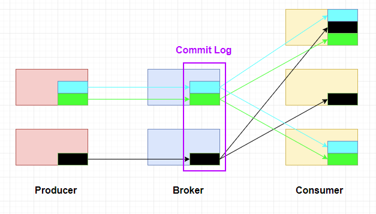

# Einleitung

In einem Unternehmen existieren in den meisten Fällen mehrere Applikationen, die unentwegt Daten in Form von Ereignissen (Events) produzieren. Bei diesen Events kann es sich um Log-Einträge von Webservern, Nutzeraktionen, Nachrichten an externe Systeme oder etwas anderes handeln. Diese Daten werden zwischen den Systemen im Unternehmen ausgetauscht, um beispielsweise Auswertungen durchzuführen oder damit ein anderes System auf bestimmte Ereignisse reagiert. Im einfachsten Fall existieren im Unternehmen nur eine Hand voll Systeme, die direkt untereinander kommunizieren. Diese direkten Kommunikationswege lassen sich bei wenigen Systemen noch gut organisieren. Wenn nun allerdings immer mehr Systeme dazu kommen und nahezu jedes System mit Jedem kommuniziert, erreicht man einen Punkt an dem die Kommunikationswege nicht mehr so einfach zu handhaben sind. Was passiert beispielsweise, wenn ein System eine Downtime benötigt und man erst herausfinden muss, von wie vielen Systemen dieses System entweder Daten empfängt oder an welche Systeme es Daten versendet. Mitunter kann das System auch einfach einen Ausfall haben, und die einzelnen Systeme müssen sich darum kümmern wie sie damit umgehen.

Um dieses Problem zu umgehen, implementiert man zwischen den Systemen eine eigene Anwendung, die sich um den Empfang und die Weitergabe der Nachrichten (Events) aus den einzelnen Systemen kümmert. Die Anwendung abonniert die Daten der Systeme und veröffentlicht sie für andere Systeme, die die Daten nutzen. Das ist dann ein Publish-Subscribe Messaging System. In einem Unternehmen könnten dann mehrere solcher Systeme existieren, die für die Vermittlung von Nachrichten einer bestimmten Sorte verantwortlich sind. Zum Beispiel ein System für die Vermittlung von Logs, Ein System für die Vermittlung von in Anwendungen gesammelten Metriken oder ein System für die Aufzeichnung von Nutzerverhalten. Mit eigenen Systemen für diese Nachrichtenvermittlung entsteht schnell viel doppelte Arbeit, obwohl alle Systeme im Grunde nur Nachrichten über Ereignisse von einem Sender an einen Empfänger vermitteln.

An diesem Punkt kommt Apache Kafka ins Spiel. Apache Kafka ist ein Open Source Software Projekt der Apache Foundation, das ursprünglich bei LinkedIn entwickelt wurde. Apache Kafka wird auf der eigenen Webseite als "distributed streaming platform", also eine verteilte Platform für Datenströme, bezeichnet. Es versteht darunter grob folgende Anwendungsmöglichkeiten:

* Veröffentlichen und Abonnieren eines Datenstroms (Streams) in Form von Ereignissen, ähnlich eines Publish-Subscribe Messaging Systems
* fehler-tolerante Speicherung von Datenströmen
* Verarbeitung von Einträgen in Datenströmen, sobald diese auftreten

Da Kafka im Wesentlichen ein Message-Broker ist beziehungsweise dies zu den Hauptaufgaben von Kafka gehört, gibt es zwei Seiten, die von Kafka bedient werden. Auf der einen Seite gibt es die Producer und auf der anderen Seite die Consumer. Kafka erhält Daten von den Producern, verarbeitet die Daten und publiziert diese an die entsprechenden Consumer.[NarkhedeShapiraPalino2017-07]  
Zu diesem Zweck werden sogenannte Topics genutzt. Ein Producer produziert Daten zu einem bestimmten Topic und das Kafka-System publiziert die Daten an alle Consumer, die sich für dieses Topic angemeldet haben.[NarkhedeShapiraPalino2017-07]  
Ein weiterer Aspekt ist, dass Kafka sogenannte Partitionierung nutzt. Dadurch ist ein Broker immer für ein Topic zuständig.[NarkhedeShapiraPalino2017-07]

Die folgende Abbildung zeigt den oben genannten Sachverhalt.

Bei der Verarbeitung von Daten ist noch zu erwähnen, dass Kafka ein sogenanntes Commit Log erstellt. Dieses hilft bei verschiedenen Fällen. Einmal dient es dazu einem Consumer, beispielsweise nach einem Ausfall, die verpassten Daten zu übergeben. Zum Anderen kann es aber auch dazu dienen nur die aktuellen Daten vorzuhalten. Dazu wird anhand eines Keys überprüft, ob hierzu ältere Daten vorliegen. Ist dies der Fall werden diese gelöscht. [NarkhedeShapiraPalino2017-07]  

Typische Use-Cases für Kafka sind Messaging, Website Activity, Metrics, Log Aggregation, Stream Processing, Event Sourcing und Commit Logs.[kafka-use-cases]  

Im Bereich des Messaging entspricht Kafka einem typischem Message Broker wie beispielsweise ActiveMQ oder RabbitMQ. Kafka wird in diesem Zusammenhang beispielsweise zum Entkuppeln von Processing und Daten-Produktion oder auch zum Vorhalten von unverarbeiteten Daten genutzt.[kafka-use-cases]  

Website Activity Tracking war die ursprünglich einzige Aufgabe von Kafka. Daten in einem Publish-Subscribe-System sollten analysiert werden. Hier werden also Daten wie Page Views, Suchen und ähnliches anylisert.[kafka-use-cases]  

Der Metrics-Bereich entspricht dem aggregieren von Statistiken.[kafka-use-cases]  

Log Aggregation wird genutzt um physikalische Logs von einem oder mehreren Servern in einem zentralen Ort zu verwalten und verarbeiten.[kafka-use-cases]  

Stream-Processing bedeutet, dass eine Pipeline zwischen Producer, Kafka und Consumer aufgebaut wird. Kafka erhält hier aus verschiedenen Quellen Daten, entfernt beispielsweise Duplikate und übergibt die Daten an die entsprechenden Consumer.[kafka-use-cases]  

Beim Event Sourcing werden beispielsweise state changes in einer zeitlichen Sortierung abgelegt. So kann im Nachhinein nachvollzogen werden, wieso ein bestimmter state gesetzt wurde oder entstanden ist.[kafka-use-cases]  

Das Commit Log wurde bereits zuvor erwähnt. Hier werden Daten aus verschiedenen Quellen vorgehalten und an verschiedene Consumer verteilt, sowie bei Bedarf ältere Einträge ersetzt oder auch gelöscht.[kafka-use-cases]  

Neben LinkedIn, wo Kafka für verschiedene Metriken genutzt wird, wird es auch von vielen weiteren namhaften Unternehmen wie beispielsweise Netflix, Paypal oder Goldman Sachs genutzt. Netflix nutzt Kafka beispielsweise zum Real-time monitoring und als event-processing pipeline.[kafka-users]  
Insgesamt zeigt sich, dass gerade Unternehmen mit großer Datenverarbeitung (so beispielsweise Netflix) Kafka nutzen.
